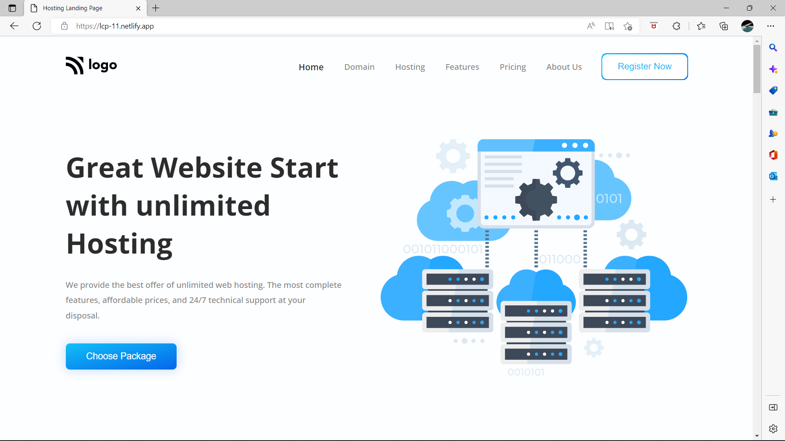

Akshay Vaidya

## What I have learnt in this project ?
- Learned to use background-image with lienar-gradient .
- Learned to create linear-gradient background color
- Learned various flexbox properties.

## Time taken to complete
### 3-4 hours

## Live Website [Link](https://lcp-11.netlify.app/)

