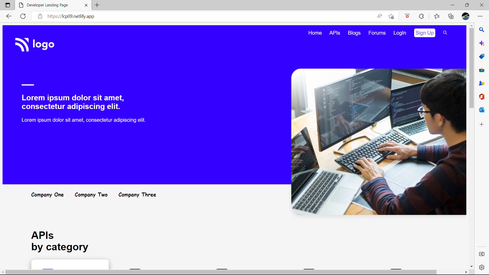
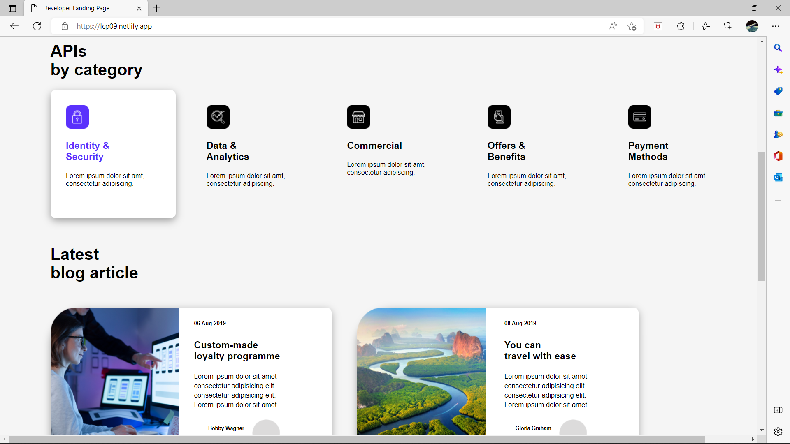
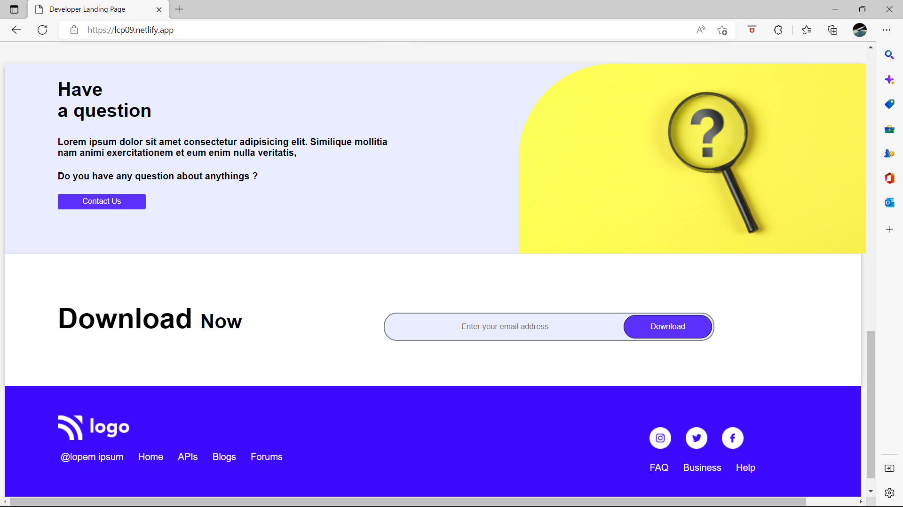

# Akshay Vaidya

## What I have learnt in this project ?
- Learned how we can center any svgs, images as background by using background-position & background-repeat.
- Learned to create linear-gradient background color
- Learned various flexbox properties.
- Learned about attribute selectors.

## Time taken to complete
### 3-4 hours

## Live Website [Link](https://lcp09.netlify.app/)

